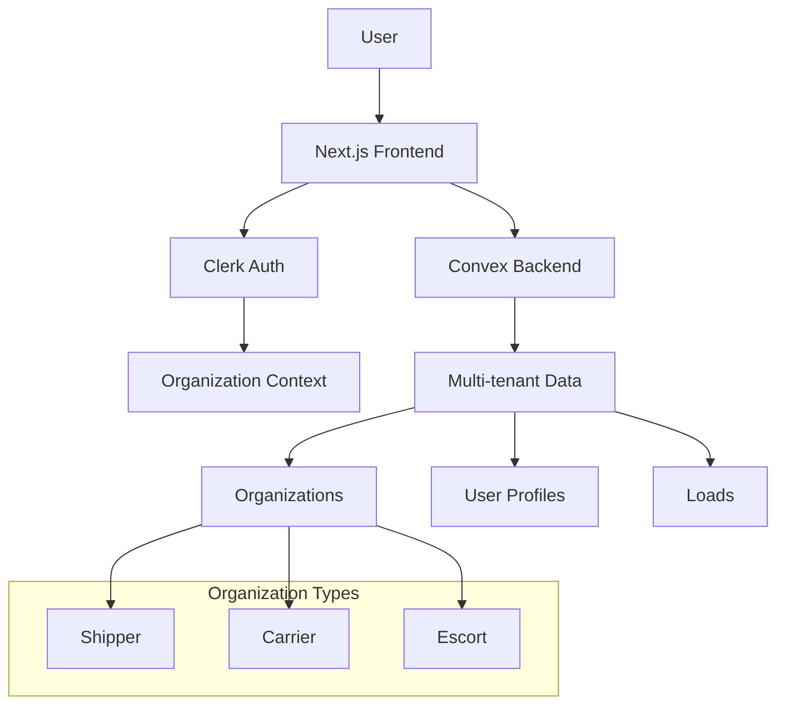
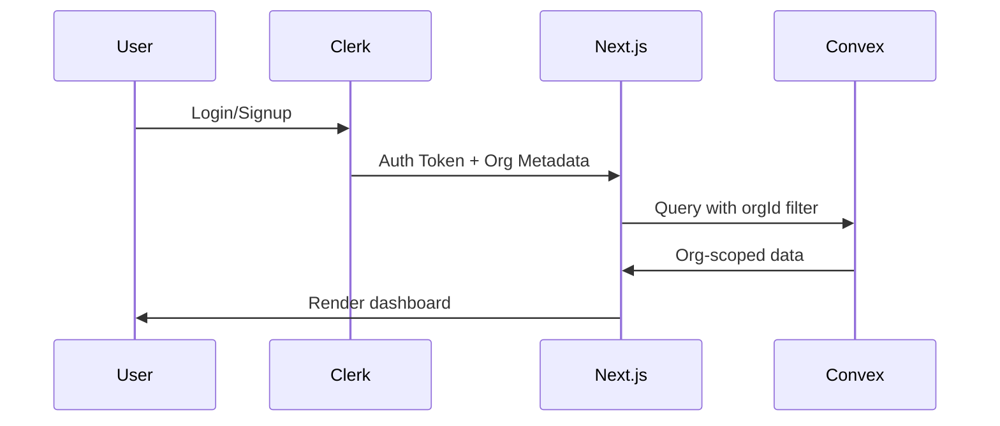

# 🧭 PARAGON HEAVY — PHASE 1 MVP ARCHITECTURE

## Project Overview

Paragon Heavy is a multi-tenant heavy haul logistics platform built with Next.js, Clerk, and Convex. Phase 1 focuses on org-level multi-tenancy with three organization types: Shippers, Carriers, and Escorts.

## Technology Stack

- **Frontend**: Next.js 14 (App Router)
- **Authentication & Organization Management**: Clerk
- **Backend & Database**: Convex
- **UI Components**: Tailwind CSS + shadcn/ui
- **Deployment**: Vercel + Convex Cloud

## System Architecture



## Data Flow Architecture



## Detailed Implementation Plan

### 1. Project Setup & Foundation

#### Core Dependencies
```json
{
  "dependencies": {
    "next": "^14.0.0",
    "react": "^18.0.0",
    "react-dom": "^18.0.0",
    "@clerk/nextjs": "^4.0.0",
    "convex": "^1.0.0",
    "tailwindcss": "^3.3.0",
    "@radix-ui/react-*": "latest",
    "class-variance-authority": "^0.7.0",
    "clsx": "^2.0.0",
    "tailwind-merge": "^2.0.0",
    "lucide-react": "^0.292.0",
    "@hookform/resolvers": "^3.3.0",
    "react-hook-form": "^7.47.0",
    "zod": "^3.22.0"
  }
}
```

#### Project Structure
```
paragonheavy/
├── app/
│   ├── (auth)/
│   │   ├── sign-in/
│   │   └── sign-up/
│   ├── (dashboard)/
│   │   ├── layout.tsx
│   │   ├── shipper/
│   │   ├── carrier/
│   │   └── escort/
│   ├── globals.css
│   ├── layout.tsx
│   └── middleware.ts
├── components/
│   ├── ui/
│   ├── forms/
│   └── layouts/
├── convex/
│   ├── schema.ts
│   ├── organizations.ts
│   ├── loads.ts
│   └── users.ts
├── hooks/
├── lib/
└── types/
```

### 2. Clerk Configuration

#### Organization Metadata Structure
```typescript
interface ClerkOrganizationMetadata {
  orgId: string;
  orgType: 'shipper' | 'carrier' | 'escort';
  displayName: string;
  createdAt: string;
}

interface ClerkUserMetadata {
  orgId: string;
  orgType: 'shipper' | 'carrier' | 'escort';
  displayName: string;
  role: 'admin'; // Phase 1: all users are admins
}
```

#### Middleware Configuration
```typescript
// middleware.ts
import { authMiddleware } from "@clerk/nextjs";

export default authMiddleware({
  publicRoutes: ["/sign-in", "/sign-up", "/"],
  afterAuth: (auth, req) => {
    // Handle organization selection/creation
    if (auth.userId && !auth.orgId && !req.nextUrl.pathname.includes('/org-selection')) {
      const orgSelectionUrl = new URL('/org-selection', req.url);
      return Response.redirect(orgSelectionUrl);
    }
  },
});

export const config = {
  matcher: ["/((?!.*\\.).*)"],
};
```

### 3. Convex Schema & Data Models

#### Complete Schema
```typescript
// convex/schema.ts
import { defineSchema, defineTable } from "convex/server";
import { v } from "convex/values";

export default defineSchema({
  organizations: defineTable({
    name: v.string(),
    type: v.union(
      v.literal("shipper"),
      v.literal("carrier"),
      v.literal("escort")
    ),
    clerkOrgId: v.string(),
    createdBy: v.string(),
    createdAt: v.number(),
    updatedAt: v.number(),
    metadata: v.optional(v.object({
      address: v.string(),
      phone: v.string(),
      email: v.string(),
      mcNumber: v.optional(v.string()),
      dotNumber: v.optional(v.string()),
    }))
  })
    .index("by_clerkOrgId", ["clerkOrgId"])
    .index("by_creator", ["createdBy"])
    .index("by_type", ["type"]),

  userProfiles: defineTable({
    clerkUserId: v.string(),
    clerkOrgId: v.string(),
    orgId: v.string(),
    email: v.string(),
    name: v.string(),
    role: v.union(v.literal("admin"), v.literal("member")),
    createdAt: v.number(),
    lastActiveAt: v.optional(v.number()),
  })
    .index("by_clerkUserId", ["clerkUserId"])
    .index("by_orgId", ["orgId"])
    .index("by_clerkOrgId", ["clerkOrgId"]),

  loads: defineTable({
    // Basic Information
    loadNumber: v.string(),
    orgId: v.string(), // shipper org
    carrierOrgId: v.optional(v.id("organizations")),
    escortOrgId: v.optional(v.id("organizations")),
    
    // Status & Workflow
    status: v.union(
      v.literal("created"),
      v.literal("carrier_assigned"),
      v.literal("in_progress"),
      v.literal("completed"),
      v.literal("cancelled")
    ),
    
    // Route Information
    origin: v.object({
      address: v.string(),
      city: v.string(),
      state: v.string(),
      zip: v.string(),
      coordinates: v.optional(v.object({
        lat: v.number(),
        lng: v.number(),
      })),
    }),
    destination: v.object({
      address: v.string(),
      city: v.string(),
      state: v.string(),
      zip: v.string(),
      coordinates: v.optional(v.object({
        lat: v.number(),
        lng: v.number(),
      })),
    }),
    
    // Load Specifications
    dimensions: v.object({
      height: v.number(),
      width: v.number(),
      length: v.number(),
      weight: v.number(),
      description: v.optional(v.string()),
    }),
    
    // Timing
    pickupDate: v.optional(v.number()),
    deliveryDate: v.optional(v.number()),
    createdAt: v.number(),
    updatedAt: v.number(),
    
    // Additional Details
    specialRequirements: v.optional(v.string()),
    contactInfo: v.optional(v.object({
      name: v.string(),
      phone: v.string(),
      email: v.string(),
    })),
  })
    .index("by_orgId", ["orgId"])
    .index("by_carrier", ["carrierOrgId"])
    .index("by_status", ["status"])
    .index("by_shipper_available", ["orgId", "status"])
    .index("by_carrier_assigned", ["carrierOrgId", "status"]),
});
```

### 4. Core Business Logic

#### Organization Management
```typescript
// convex/organizations.ts
import { mutation, query } from "./_generated/server";
import { v } from "convex/values";

export const createOrganization = mutation({
  args: {
    name: v.string(),
    type: v.union(v.literal("shipper"), v.literal("carrier"), v.literal("escort")),
    clerkOrgId: v.string(),
    metadata: v.optional(v.object({
      address: v.string(),
      phone: v.string(),
      email: v.string(),
      mcNumber: v.optional(v.string()),
      dotNumber: v.optional(v.string()),
    }))
  },
  handler: async (ctx, args) => {
    const identity = await ctx.auth.getUserIdentity();
    if (!identity) throw new Error("Not authenticated");

    const orgId = await ctx.db.insert("organizations", {
      ...args,
      createdBy: identity.subject,
      createdAt: Date.now(),
      updatedAt: Date.now(),
    });

    // Create user profile
    await ctx.db.insert("userProfiles", {
      clerkUserId: identity.subject,
      clerkOrgId: args.clerkOrgId,
      orgId,
      email: identity.email ?? "",
      name: identity.name ?? "",
      role: "admin",
      createdAt: Date.now(),
    });

    return orgId;
  },
});

export const getOrganizationByClerkId = query({
  args: { clerkOrgId: v.string() },
  handler: async (ctx, args) => {
    return await ctx.db
      .query("organizations")
      .withIndex("by_clerkOrgId", (q) => q.eq("clerkOrgId", args.clerkOrgId))
      .first();
  },
});
```

#### Load Management
```typescript
// convex/loads.ts
import { mutation, query } from "./_generated/server";
import { v } from "convex/values";

export const createLoad = mutation({
  args: {
    loadNumber: v.string(),
    origin: v.object({
      address: v.string(),
      city: v.string(),
      state: v.string(),
      zip: v.string(),
    }),
    destination: v.object({
      address: v.string(),
      city: v.string(),
      state: v.string(),
      zip: v.string(),
    }),
    dimensions: v.object({
      height: v.number(),
      width: v.number(),
      length: v.number(),
      weight: v.number(),
      description: v.optional(v.string()),
    }),
    pickupDate: v.optional(v.number()),
    deliveryDate: v.optional(v.number()),
    specialRequirements: v.optional(v.string()),
    contactInfo: v.optional(v.object({
      name: v.string(),
      phone: v.string(),
      email: v.string(),
    })),
  },
  handler: async (ctx, args) => {
    const identity = await ctx.auth.getUserIdentity();
    if (!identity) throw new Error("Not authenticated");

    // Get user's organization
    const userProfile = await ctx.db
      .query("userProfiles")
      .withIndex("by_clerkUserId", (q) => q.eq("clerkUserId", identity.subject))
      .first();

    if (!userProfile) throw new Error("User profile not found");

    const loadId = await ctx.db.insert("loads", {
      ...args,
      orgId: userProfile.orgId,
      status: "created",
      createdAt: Date.now(),
      updatedAt: Date.now(),
    });

    return loadId;
  },
});

export const getAvailableLoads = query({
  handler: async (ctx) => {
    return await ctx.db
      .query("loads")
      .withIndex("by_status", (q) => q.eq("status", "created"))
      .collect();
  },
});

export const assignCarrier = mutation({
  args: {
    loadId: v.id("loads"),
    carrierOrgId: v.id("organizations"),
  },
  handler: async (ctx, args) => {
    await ctx.db.patch(args.loadId, {
      carrierOrgId: args.carrierOrgId,
      status: "carrier_assigned",
      updatedAt: Date.now(),
    });
  },
});

export const updateLoadStatus = mutation({
  args: {
    loadId: v.id("loads"),
    status: v.union(
      v.literal("created"),
      v.literal("carrier_assigned"),
      v.literal("in_progress"),
      v.literal("completed"),
      v.literal("cancelled")
    ),
  },
  handler: async (ctx, args) => {
    await ctx.db.patch(args.loadId, {
      status: args.status,
      updatedAt: Date.now(),
    });
  },
});
```

### 5. UI Components & Layout Structure

#### Main Dashboard Layout
```typescript
// components/layouts/DashboardLayout.tsx
import { ReactNode } from "react";
import { OrgSwitcher } from "@/components/OrgSwitcher";
import { UserButton } from "@clerk/nextjs";
import { Sidebar } from "@/components/Sidebar";

interface DashboardLayoutProps {
  children: ReactNode;
}

export function DashboardLayout({ children }: DashboardLayoutProps) {
  return (
    <div className="flex h-screen bg-gray-50">
      <Sidebar />
      <div className="flex-1 flex flex-col">
        <header className="bg-white border-b border-gray-200 px-6 py-4">
          <div className="flex items-center justify-between">
            <OrgSwitcher />
            <UserButton afterSignOutUrl="/" />
          </div>
        </header>
        <main className="flex-1 overflow-hidden">
          <div className="h-full flex">
            <div className="flex-1 p-6">
              {children}
            </div>
            <LoadDetailPanel />
          </div>
        </main>
      </div>
    </div>
  );
}
```

#### Load List Component
```typescript
// components/loads/LoadList.tsx
import { useQuery } from "convex/react";
import { api } from "@/convex/_generated/api";
import { LoadCard } from "./LoadCard";
import { LoadDetailPanel } from "./LoadDetailPanel";

interface LoadListProps {
  orgType: "shipper" | "carrier" | "escort";
}

export function LoadList({ orgType }: LoadListProps) {
  const loads = useQuery(api.loads.getLoadsForOrg, { orgType });

  if (!loads) return <div>Loading...</div>;

  return (
    <div className="space-y-4">
      <div className="flex justify-between items-center">
        <h2 className="text-2xl font-bold">
          {orgType === "shipper" && "My Loads"}
          {orgType === "carrier" && "Available Loads"}
          {orgType === "escort" && "Assignments"}
        </h2>
        {orgType === "shipper" && (
          <CreateLoadButton />
        )}
      </div>
      
      <div className="grid gap-4">
        {loads.map((load) => (
          <LoadCard
            key={load._id}
            load={load}
            orgType={orgType}
            onClick={() => setSelectedLoad(load._id)}
          />
        ))}
      </div>
    </div>
  );
}
```

### 6. Organization-Specific Dashboards

#### Shipper Dashboard
```typescript
// app/(dashboard)/shipper/page.tsx
import { DashboardLayout } from "@/components/layouts/DashboardLayout";
import { LoadList } from "@/components/loads/LoadList";
import { OrgStats } from "@/components/OrgStats";

export default function ShipperDashboard() {
  return (
    <DashboardLayout>
      <div className="space-y-6">
        <OrgStats orgType="shipper" />
        <LoadList orgType="shipper" />
      </div>
    </DashboardLayout>
  );
}
```

#### Carrier Dashboard
```typescript
// app/(dashboard)/carrier/page.tsx
import { DashboardLayout } from "@/components/layouts/DashboardLayout";
import { LoadList } from "@/components/loads/LoadList";
import { OrgStats } from "@/components/OrgStats";

export default function CarrierDashboard() {
  return (
    <DashboardLayout>
      <div className="space-y-6">
        <OrgStats orgType="carrier" />
        <LoadList orgType="carrier" />
      </div>
    </DashboardLayout>
  );
}
```

### 7. Real-time Updates & Error Handling

#### Convex Real-time Integration
```typescript
// hooks/useRealtimeLoads.ts
import { useQuery, useMutation } from "convex/react";
import { api } from "@/convex/_generated/api";
import { Id } from "@/convex/_generated/dataModel";

export function useRealtimeLoads(orgId: Id<"organizations">) {
  const loads = useQuery(api.loads.getLoadsForOrg, { orgId });
  const updateLoadStatus = useMutation(api.loads.updateLoadStatus);
  const assignCarrier = useMutation(api.loads.assignCarrier);

  return {
    loads,
    updateLoadStatus,
    assignCarrier,
    isLoading: loads === undefined,
  };
}
```

#### Error Boundary & Toast Notifications
```typescript
// components/ErrorBoundary.tsx
import { Component, ErrorInfo, ReactNode } from "react";
import { toast } from "sonner";

interface Props {
  children: ReactNode;
}

interface State {
  hasError: boolean;
}

export class ErrorBoundary extends Component<Props, State> {
  public state: State = {
    hasError: false
  };

  public static getDerivedStateFromError(): State {
    return { hasError: true };
  }

  public componentDidCatch(error: Error, errorInfo: ErrorInfo) {
    console.error("Uncaught error:", error, errorInfo);
    toast.error("Something went wrong. Please try again.");
  }

  public render() {
    if (this.state.hasError) {
      return (
        <div className="flex items-center justify-center h-64">
          <div className="text-center">
            <h2 className="text-xl font-semibold text-gray-900">Something went wrong</h2>
            <p className="mt-2 text-gray-600">Please refresh the page and try again.</p>
          </div>
        </div>
      );
    }

    return this.props.children;
  }
}
```

## Testing Strategy

### Unit Tests
- Convex function testing
- Component testing with React Testing Library
- Form validation testing

### Integration Tests
- End-to-end user flows
- Clerk authentication flows
- Multi-tenant data isolation

### Manual Testing Checklist
- [ ] Organization creation and user onboarding
- [ ] Shipper load creation and management
- [ ] Carrier load discovery and acceptance
- [ ] Load status transitions
- [ ] Real-time updates across multiple sessions
- [ ] Data isolation between organizations

## Deployment Plan

### Environment Configuration
```typescript
// .env.local
NEXT_PUBLIC_CLERK_PUBLISHABLE_KEY=
CLERK_SECRET_KEY=
NEXT_PUBLIC_CLERK_SIGN_IN_URL=/sign-in
NEXT_PUBLIC_CLERK_SIGN_UP_URL=/sign-up
NEXT_PUBLIC_CLERK_AFTER_SIGN_IN_URL=/dashboard
NEXT_PUBLIC_CLERK_AFTER_SIGN_UP_URL=/dashboard

CONVEX_DEPLOYMENT=
CONVEX_URL=
```

### Vercel Deployment Steps
1. Connect GitHub repository to Vercel
2. Configure environment variables
3. Set up custom domains
4. Configure Convex deployment
5. Set up monitoring and analytics

## Success Metrics

### Technical Metrics
- Page load time < 2 seconds
- Real-time updates < 500ms latency
- 99.9% uptime
- Zero data leakage between tenants

### Business Metrics
- Organization signup conversion rate
- Load creation to carrier assignment time
- User engagement (daily active users)
- Load completion rate

## Next Steps (Phase 2 Preparation)

1. **Escort Workflows**: Full escort assignment and management
2. **Route Mapping**: Integration with mapping services
3. **Compliance Engine**: Automated permit and regulation checking
4. **File Management**: Document upload and management
5. **GPS Tracking**: Real-time load tracking
6. **Billing System**: Cost calculation and invoicing
7. **Advanced Permissions**: Role-based access control
8. **Analytics & Reporting**: Business intelligence dashboard

This architecture provides a solid foundation for the Phase 1 MVP while being scalable for future enhancements.