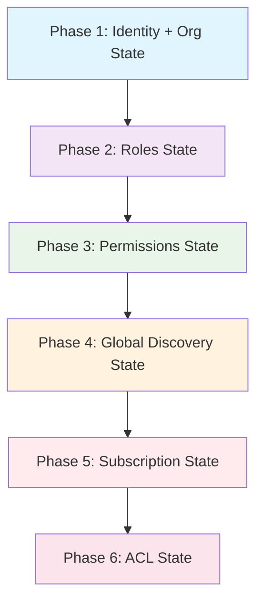
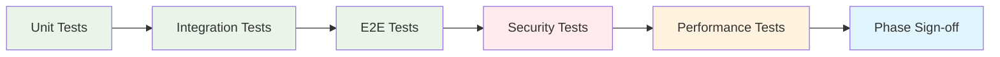

# Implementation Roadmap - Design

## Context
This capability provides the strategic framework for implementing multi-tenancy in Paragon Heavy. It defines a phased approach that builds complexity incrementally while maintaining system stability and ensuring all invariants are preserved throughout the implementation process.

## Goals / Non-Goals
- **Goals:**
  - Provide structured approach to multi-tenant implementation
  - Ensure each phase builds incrementally on previous work
  - Maintain system stability and invariants throughout
  - Enable comprehensive testing and validation at each stage
  
- **Non-Goals:**
  - Define specific technical implementation details (handled by individual capability specs)
  - Provide project management methodologies
  - Define deployment strategies

## Decisions

### Sequential Phase Approach
- **Decision:** Implement five sequential phases with clear dependencies
- **Rationale:** Reduces complexity, enables focused development, and ensures stability
- **Alternatives considered:** Parallel development, big-bang implementation, feature-based approach

### Phase Duration Allocation
- **Decision:** 1-2 weeks per phase with minimal overlap, extending to 7-9 weeks total
- **Rationale:** Allows adequate time for implementation, testing, and validation of each DET STATE checkpoint
- **Alternatives considered:** Fixed 1-week phases, 4-week phases, time-boxed sprints

### Invariant-Driven Development
- **Decision:** Focus on maintaining critical invariants throughout implementation with DET STATE validation
- **Rationale:** Ensures system integrity, prevents data leakage, and provides clear phase completion criteria
- **Alternatives considered:** Feature-driven development, user-story driven approach

### DET STATE Alignment
- **Decision:** Align each phase with specific deterministic state checkpoint
- **Rationale:** Provides clear validation criteria, ensures deterministic progression, and separates concerns appropriately
- **Alternatives considered:** Feature-based phases, capability-based phases, timeline-driven phases

### Comprehensive Testing Strategy
- **Decision:** Unit, integration, and E2E testing for each phase
- **Rationale:** Ensures quality and prevents regressions
- **Alternatives considered:** Unit testing only, manual testing only, automated testing only

## Phase Dependencies

## Implementation Strategy

### Phase 1 Identity + Org State (Week 1-2)
**Focus Areas:**
- Authentication infrastructure with Clerk
- Organization and membership data models
- Identity-only foundation without role-based permissions
- Organization creation workflows
- JWT token management with minimal claims

**Success Criteria:**
- Users can authenticate with organization context
- Organizations can be created with atomic membership
- No role-based permissions are enforced (identity-only)
- All identity invariants are maintained
- JWT tokens contain only necessary identity and organization claims

### Phase 2 Roles State (Week 2-3)
**Focus Areas:**
- Membership roles as data attached to user/organization membership
- Role vocabulary definition and management
- Role data storage and retrieval
- Role listing and updating capabilities

**Success Criteria:**
- Roles exist purely as data without affecting access control
- Defined role vocabulary (Admin, Manager, Operator) is supported
- Role data can be listed, stored, and updated
- No RBAC enforcement or permission checks based on role
- All role data invariants are maintained

### Phase 3 Permissions State (Week 3-4)
**Focus Areas:**
- Deterministic permission map defining capabilities for each role
- Backend permission enforcement helpers (hasPermission)
- Role-based permission enforcement for tenant-scoped CRUD
- UI permission gating with clear error messages

**Success Criteria:**
- Permission map is deterministic and comprehensive
- Backend helpers are available for permission enforcement
- Tenant-scoped CRUD operations enforce role-based permissions
- UI flows properly gate actions based on permissions
- All permission invariants are maintained

### Phase 4 Global Discovery State (Week 4-5)
**Focus Areas:**
- Global tables for cross-organization discovery
- Deterministic organization linking for global records
- Publishing tenant-scoped resources to global tables
- Cross-organization browsing and querying capabilities

**Success Criteria:**
- Global records are linked to owning organizations
- Basic read-only access is available to all organizations
- No subscription-based or ACL-based access logic is enforced
- Global discovery is purely data-driven
- All global discovery invariants are maintained

### Phase 5 Subscription State (Week 5-7)
**Focus Areas:**
- Subscription tables for global resources
- Explicit access level definitions (view, bid, accept, track, update)
- Subscription lifecycle management (subscribe, unsubscribe, expire)
- Subscription-based access control enforcement

**Success Criteria:**
- Organizations can subscribe and unsubscribe to specific resources
- Access levels are properly enforced (hierarchical)
- Subscription-based access control is enforced for non-owners
- Time-limited subscriptions work correctly
- All subscription invariants are maintained

### Phase 6 ACL State (Week 7-9)
**Focus Areas:**
- ACL data models for explicit cross-organization sharing
- Permission level definitions and expiration model
- ACL entry management (grant, revoke, list)
- Integration with subscription-based access control

**Success Criteria:**
- Organizations can grant explicit access to tenant-scoped resources
- ACL permissions are properly enforced with expiration
- ACL checks complement subscription-based access control
- Time-limited ACLs work correctly
- All ACL invariants are maintained

## Risk Management

### Technical Risks
- **Data Migration Complexity:** Moving from single-tenant to multi-tenant
- **Performance Impact:** Additional filtering and validation overhead
- **Security Vulnerabilities:** Multi-tenancy increases attack surface
- **DET STATE Validation:** Ensuring deterministic progression between phases

### Mitigation Strategies
- **Incremental Migration:** Six-phase approach with DET STATE checkpoints reduces complexity
- **Performance Monitoring:** Continuous monitoring and optimization
- **Security Testing:** Comprehensive security validation at each DET STATE checkpoint
- **Deterministic Validation:** Clear criteria for phase completion through DET STATE invariants

### Project Risks
- **Timeline Delays:** Each phase depends on previous completion (7-9 weeks total)
- **Resource Allocation:** Multi-disciplinary requirements across six phases
- **Integration Challenges:** Phase dependencies may cause issues
- **Phase Separation:** Ensuring clear boundaries between roles, permissions, global discovery, subscriptions, and ACLs

### Mitigation Strategies
- **Buffer Time:** Extra time allocated for each phase, especially complex phases 3, 5, and 6
- **Cross-Functional Team:** Diverse skills for all requirements
- **Integration Testing:** Thorough testing between phases with DET STATE validation
- **Clear Phase Boundaries:** Explicit separation of concerns between DET STATE checkpoints

## Quality Assurance

### Testing Strategy

### Validation Criteria
- **Functional Requirements:** All specified functionality works correctly
- **Non-Functional Requirements:** Performance, security, and usability standards met
- **Invariant Compliance:** All invariants are maintained
- **Integration Success:** New features work with existing functionality

## Documentation Strategy

### Documentation Types
- **Technical Specifications:** Detailed design and implementation guides
- **API Documentation:** Complete API references and examples
- **User Documentation:** Guides for end-users and administrators
- **Operations Documentation:** Deployment and maintenance procedures

### Documentation Timeline
- **Phase Documentation:** Updated during each phase implementation
- **Integration Documentation:** Updated when phases are integrated
- **Final Documentation:** Comprehensive review and completion

## Monitoring and Metrics

### Implementation Metrics
- **Velocity:** Story points completed per iteration
- **Quality:** Defect density and test coverage
- **Timeline:** Phase completion vs. planned dates
- **Stability:** System uptime and error rates

### Success Metrics
- **Functional:** All acceptance criteria met
- **Technical:** Performance and security standards achieved
- **Business:** User adoption and satisfaction
- **Operational:** Documentation and support readiness

## Resource Planning

### Team Composition
- **Backend Developers:** Convex functions and database design
- **Frontend Developers:** React components and user interfaces
- **DevOps Engineers:** Deployment and infrastructure
- **QA Engineers:** Testing and validation
- **Technical Writers:** Documentation and guides

### Technology Requirements
- **Development Environment:** Local development with Convex dev
- **Testing Environment:** Staging with full functionality
- **Production Environment:** Scalable infrastructure
- **Monitoring Tools:** Performance and security monitoring

## Open Questions
- How to handle rollback if a DET STATE phase needs to be reverted?
- What level of automation should be implemented for DET STATE phase transitions?
- How to handle concurrent development of overlapping phases while maintaining DET STATE integrity?
- What criteria should trigger phase rework or extension based on DET STATE validation?
- How to balance speed vs. quality in six-phase implementation with DET STATE checkpoints?
- How to ensure clear separation between roles-as-data (Phase 2) and permissions enforcement (Phase 3)?
- How to validate that global discovery (Phase 4) remains data-only before subscription and ACL phases?