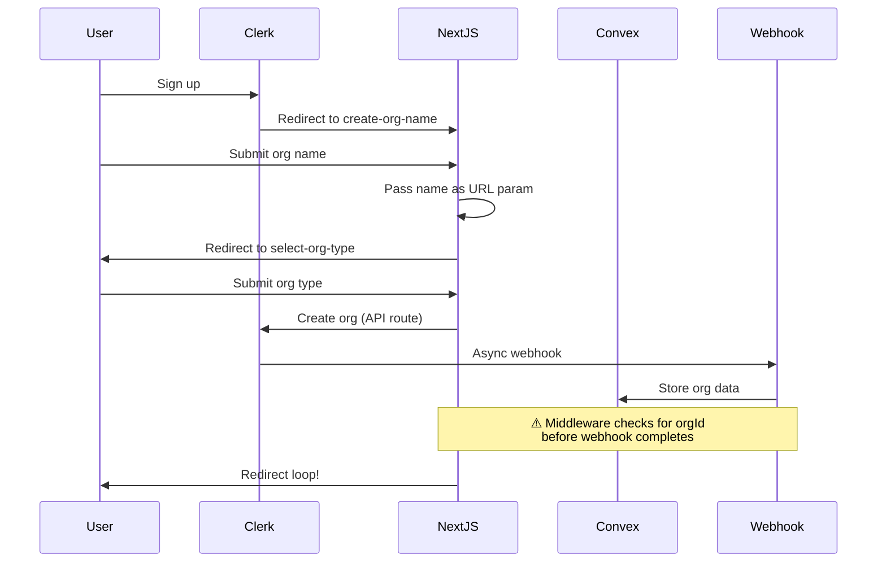
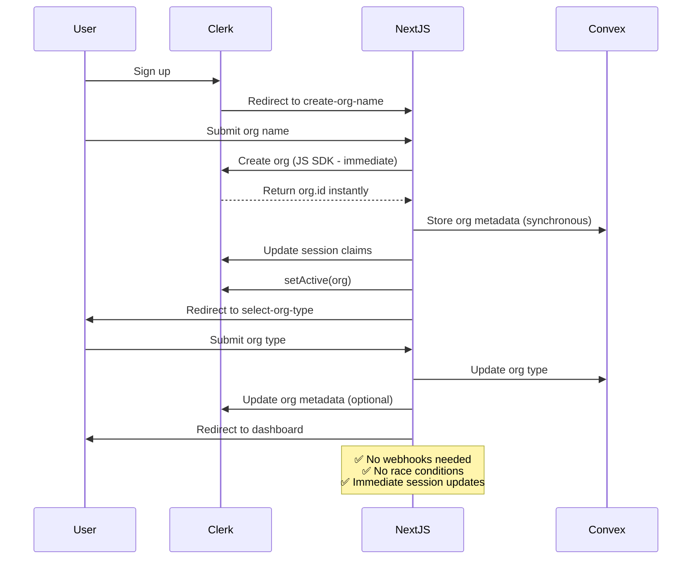

# Sign-Up Flow Architecture

## Current (Problematic) Flow



## New (Synchronous) Flow



## Key Differences

| Aspect | Current Flow | New Flow |
|--------|---------------|-----------|
| Organization Creation | API route + webhook | Clerk JS SDK (immediate) |
| Convex Sync | Async webhook | Synchronous mutation |
| Session Claims | Updated by webhook | Updated immediately |
| Race Conditions | ❌ Common | ✅ Eliminated |
| User Experience | ❌ Redirect loops | ✅ Smooth progression |
| Reliability | ❌ Timing dependent | ✅ Deterministic |

## Implementation Components

### Step B: create-org-name
```typescript
// Immediate organization creation
const org = await clerk.organizations.createOrganization({...});
await convex.createOrganization({...});
await user.update({unsafeMetadata: {primaryOrgId: org.id}});
await setActive({organization: org.id});
```

### Step C: select-org-type  
```typescript
// Just update type, org already exists
await convex.updateOrganizationType({...});
await convex.markOnboardingComplete({...});
```

### Middleware Logic
```typescript
// No more race conditions
if (userId && !orgId) {
  redirect('/sign-up/tasks/create-org-name');
}
// orgId available immediately after Step B